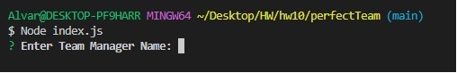
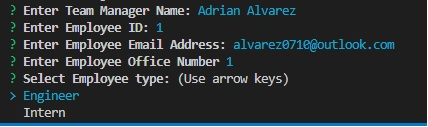
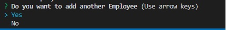
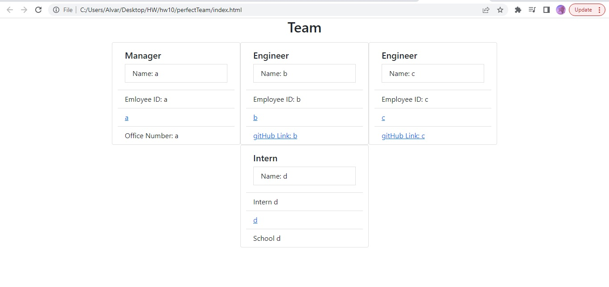

# perfectTeam
Team Profile Generator
User Story:
With this app you will be able to generate a team profile using CMD Terminal.
To start this program, you will have to open your command terminal and run the "node index.js".

Then, you will be prompted with a set of question to build your team profile.
You will have a set of questions whether you want to add a Manager, en Engineer and an Intern. Each role will come with a set of questions regarding contact information based on their position.
The app will give the add members as much as you want until you decide to quit buikding the team.

Screen shots:

Start

After you set the manager, automatically you will be asked what type of employee you want to add.

After you are done entering the info of the engineer or intern, you will be asked if you want to add another employee, if yes, it wil ask you again what type of employee you want.
If no, your team profile will be created in an index.html file.

